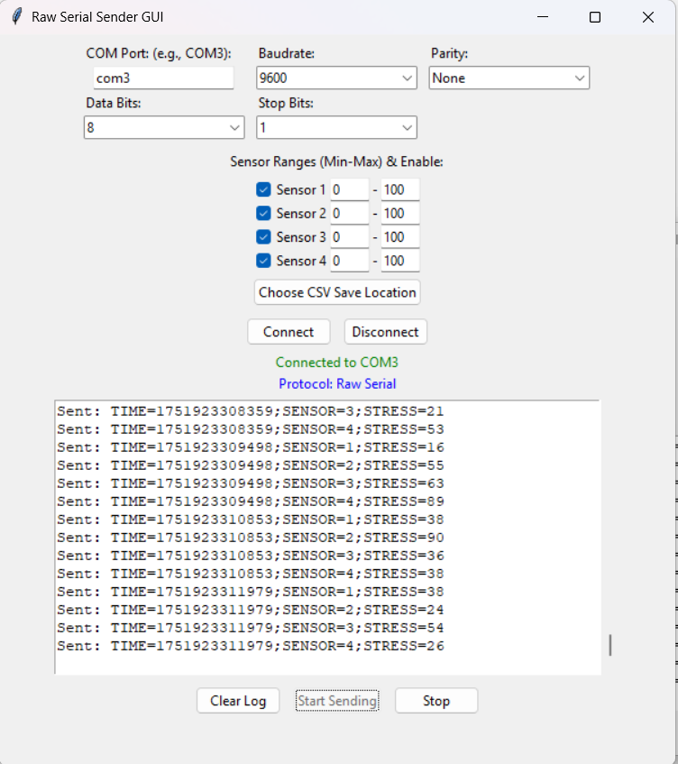
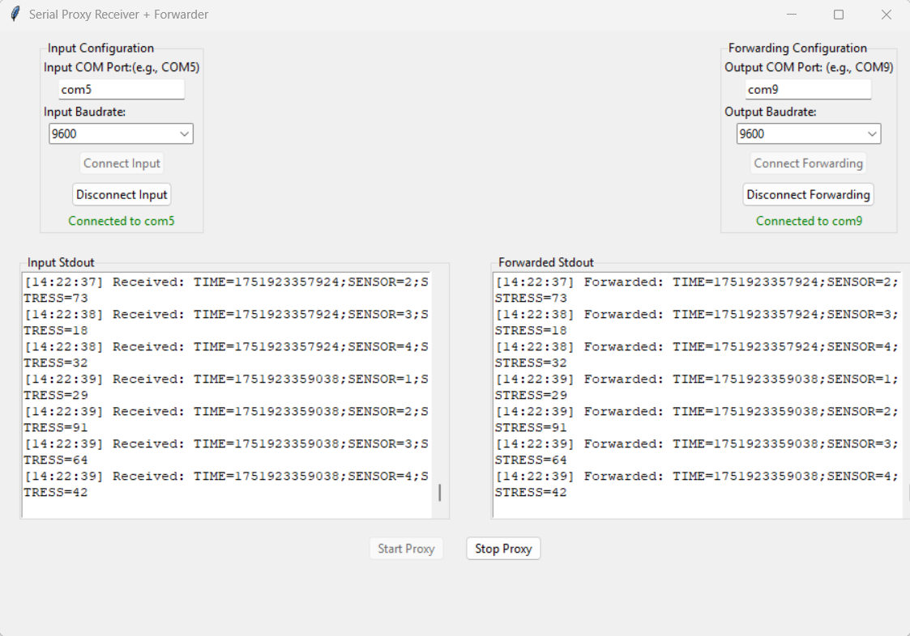
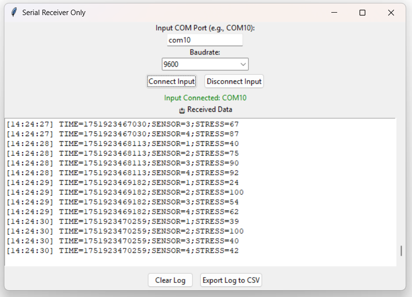

```plaintext
RawSerialProxyESP32/
├── README.md                  # Project documentation
├── LICENSE                    # License file
├── requirements.txt           # Python dependencies
├── images/                    # GUI screenshots
│   ├── sender_gui.png
│   ├── proxy_gui.png
│   └── receiver_gui.png
├── csv/                       # Automatically saved CSV log files
│   └── (CSV log files will be saved here)
├── RawSerialSender.py         # Simulates ESP32/Arduino sensor output
├── RawSerialProxy.py          # Forwards and logs serial data
└── RawSerialReceiver.py       # Displays and logs received data
```
## 📘 Introduction

**Raw Serial Proxy for ESP32** is a Python-based project for **Windows** that allows you to **simulate, forward, and monitor raw serial data**, making it especially useful for IoT devices like the **ESP32**.

The project consists of three components:

- **Sender** – Simulates an ESP32 (or Arduino) by sending data
- **Proxy** – Bridges and logs serial communication
- **Receiver** – While the receiver component acts as a simple data consumer for testing purposes, in real applications, one can use MATLAB or other visualization tools to receive and analyze the data.

These components work together to:

- Emulate sensor devices
- Bridge real serial data to **virtual COM ports**
- Enable simultaneous data access across multiple applications

> ⚠️ On Windows, a serial port can typically be opened by only **one process at a time**.  
> This proxy setup **circumvents** that limitation by duplicating the data stream to a virtual port.  
> *(Reference: stackoverflow.com)*
> 
---


## 🧩 Components

### 🔹 Raw Serial Sender

Simulates an IoT sensor device (e.g., **ESP32** or **Arduino**) by sending raw ASCII serial data through a selected **COM port**.

**Features:**
- GUI interface to select the output COM port
- Configurable sensor value ranges
- Live log display of transmitted data
---
The Raw Serial Sender application simulates a device by sending out raw serial data...



---
---

### 🔹 Raw Serial Proxy

A GUI application that:

- Reads raw data from a **real COM port** (e.g., from a physical device)
- Optionally logs and parses the incoming data
- Forwards it to a **virtual COM port**
---
  The Raw Serial Proxy bridges data from a real device to a virtual port...



---

**Acts as a data bridge**, logging both incoming and forwarded data for inspection or long-term storage.
## 💡 Use Cases

### 🔧 Device Simulation

Develop and test software that expects **ESP32/Arduino sensor data** without needing actual hardware.

- The **Sender** generates dummy sensor readings over serial.
- Useful for testing how applications handle real-time data streams.

---

### 🔄 Data Bridge for Analysis

Use the **Proxy** to connect a real device to an analytics program.

- Example: Forward sensor data from an ESP32 on `COM3` to a **virtual COM port**
- Tools like **MATLAB** or **Power BI** can read from the virtual port in real-time.
- Enables simultaneous access by multiple applications:
  - One reads the **real port**
  - Another reads the **mirror virtual port**

> ⚠️ This solves the one-port-one-process limitation on Windows.  
> *(Reference: stackoverflow.com)*

---

### 📊 Logging and Monitoring

Insert the **Proxy** between your device and main application:

- Logs raw data for debugging or record-keeping
- Saves all incoming/outgoing serial data to `.csv` files in the `csv/` folder
- Continues passing data along to the end application without interruption

---

### 🧪 Receiver Testing

Use the **Raw Serial Receiver** to:

- Verify and visualize incoming data streams
- Validate the format and content of simulated or real data
- Confirm compatibility with downstream applications

  ---
The Raw Serial Receiver acts as a listener on a COM port...


  ---

> 🖥️ Can also act as a **lightweight dashboard** to monitor sensor outputs live
## ⚙️ Installation and Setup

### ✅ Prerequisites

Ensure the following are installed on your system:

- 🪟 **Windows 10 or 11**
- 🐍 **Python 3.x**
- 📦 `pip` (Python package manager)

> This project uses:
> - `pyserial` for serial communication
> - A GUI library like `PySimpleGUI` or `tkinter`

---

### 📥 Step 1: Clone or Download the Project

Download the project files and place them in a folder (e.g., `RawSerialProxyESP32`).

Ensure the directory contains subfolders like:

- `images/` → stores GUI screenshots  
- `csv/` → stores log files automatically generated during runtime

Refer to the [📁 Project Structure](#-project-structure) section for folder layout.

---

### 📦 Step 2: Install Python Dependencies

Open a **Command Prompt** in the project directory and run:

```bash
pip install -r requirements.txt
```
This will install required packages such as:

- `pyserial` (for serial communication)
- A GUI library like `PySimpleGUI` or `tkinter`

---

### 🔌 Step 3: Set Up a Virtual COM Port Pair (com0com)

The **Raw Serial Proxy** requires a pair of **linked COM ports**:

- One for the **proxy’s output**
- One for the **receiver’s input**

To accomplish this, we use **com0com**, an open-source *null-modem emulator* for Windows.

> It creates virtual COM port pairs where the output of one port is the input of the other (and vice versa).  


---

#### 🔽 Download com0com

1. Get the **signed com0com driver** from:
   - 🔗 Github
     *(or from the SourceForge project page)*

2. Run the installer  
   - 🛡️ *Administrator privileges may be required*

3. During installation, enable the option to **create a port pair**, often labeled as:

```plaintext
CNCA0 <-> CNCB0  
or  
COM# <-> COM#
```

#### 🛠️ Configure the Virtual Ports

After installation, open the **com0com Setup** program  
*(found in the Start Menu under **com0com**).*

In the setup GUI, you should see a **default virtual pair**, typically named:

```plaintext
CNCA0  
CNCB0
```
Rename these to two **unused COM port numbers**. For example:

```plaintext
CNCA0 → COM8  
CNCB0 → COM9
```
💡 You can choose any COM numbers that are not currently in use by real hardware devices.

#### ⚙️ Enable Necessary Options

Make sure the new virtual ports are configured as **regular COM ports**:

- ✅ Check **Use Port Class** for both ports  
  *(This ensures they appear as standard COM ports in Device Manager)*  
 
- ✅ Enable **Emulate Baud Rate** for both ports  
  *(Allows the virtual ports to ignore mismatched baud rates)*  


After configuring these settings, click **Apply / OK** in the com0com setup to save the changes.

#### ✅ Verify the Virtual Ports

1. Open **Device Manager** on Windows  
2. Expand the **Ports (COM & LPT)** section  
3. You should see the two new COM ports, for example:

```plaintext
COM8  
COM9
```
hese two ports now act as a connected pair:
➡️ Any data written to COM8 will be received by COM9, and vice versa.

> ℹ️ **Note:**  
> The virtual ports will appear even if no program is using them.  
> You may choose different COM numbers, but always **remember which two form a pair**.  
> This documentation assumes a virtual pair of `COM8 ↔ COM9`.

---

### 🔗 Step 4: Connect Your Device (if using a real ESP32)

If you plan to use the **Raw Serial Proxy** with an actual device:

1. Plug in your **ESP32** or **Arduino** via **USB**
2. Open **Device Manager**
3. Look under **Ports (COM & LPT)** to find the assigned COM port  
   - It will typically appear as:  
     ```plaintext
     USB Serial Device (COMx)
     ```

Take note of this COM port — it will be used as the **input port** for the proxy.

> 🔧 If you're only simulating data using the **Sender**, you can skip this step.

### ✅ Final Notes

With the environment fully set up and all dependencies installed, you can now run each component as needed:

- `RawSerialSender.py` → Simulates sensor data
- `RawSerialProxy.py` → Bridges and logs serial data
- `RawSerialReceiver.py` → Displays and logs received data

Make sure the `images/` folder contains the required **GUI screenshots** (or appropriate placeholders) so that all image references in the `README.md` render correctly.

The **Raw Serial Sender** application simulates a device by sending raw serial data through a selected **COM port**.  
It is particularly useful for testing systems when the actual hardware (e.g., ESP32 or Arduino) is not available.

### 🔧 Key Features

- GUI interface to:
  - Select the **output COM port**
  - Configure **sensor data ranges**
  - Start/stop data transmission

- Sends data in **plain ASCII text**

- 📟 Displays **outgoing data in real-time**
- 📝 Automatically logs transmitted data to a **CSV file**


### 🧪 How to Use the Raw Serial Sender

1. **Prepare the Output Port**  
   Decide which **COM port** the Sender will use to emit data.  
   - You can use one end of a virtual pair (e.g., `COM8`) if you're routing it into the **Proxy/Receiver**,  
   - Or any available free COM port (including physical loopback devices if you have one).

2. **Launch the Sender**  
   Run the `RawSerialSender.py` script:
   ```bash
   python RawSerialSender.py

   
   ```
   Or simply **double-click** the file to open the **Sender GUI**.

---

### 🎛️ Select COM Port

Use the drop-down menu in the GUI to choose your output port.  
Example: Select `COM8` if you're using the `COM8 ↔ COM9` virtual pair.

---

### ⚙️ Configure Data Settings

- Set sensor value ranges (e.g., **temperature: 20–30°C**, **humidity: 30–60%**)
- Specify the number of sensors, update interval, and data format

Adjust the following fields using the GUI:

- 🔢 **Min/Max values**
- ⏱️ **Send interval**
- 🔀 **Number of channels**

---

### ▶️ Start Sending

Click the **"Start"** (or **"Send"**) button to begin transmission.  
The Sender will start sending simulated data at the configured interval.  
You will see the data stream in real-time in the **log area** of the GUI.

---

### 📊 Monitor & Log

- Watch the **real-time log panel** to view outgoing data
- All data is saved automatically to:

```plaintext
csv/sender_log.csv
```
Each entry includes a **timestamp** for precise logging.

---

### ⏹️ Stop Sending

Click the **"Stop"** button to halt transmission.  
You may reconfigure the settings and start again, or simply close the application when you're done.


## 🔁 Raw Serial Proxy

The **Raw Serial Proxy** acts as a **bridge** between a real device and a virtual port.

It reads incoming serial data from your actual device’s **input COM port**, and forwards it in **real-time** to a selected **virtual COM port**.  
This allows other applications to read the forwarded data as if it were coming directly from the physical device.

### 🔧 Key Features

- Select **Input Port** (real device) and **Output Port** (virtual COM)
- Real-time forwarding of serial data
- Side-by-side display of:
  - 📥 **Incoming data**
  - 📤 **Forwarded data**
- Automatic logging of both streams to **CSV files** for debugging or analysis

> 🖼️ *Figure: Raw Serial Proxy interface – user selects input and output ports. Incoming data (left) and forwarded data (right) are displayed and logged.*

### 🧭 How to Use the Raw Serial Proxy

1. **Connect the Device**  
   Ensure your **ESP32** (or similar device) is connected via USB, and note its assigned COM port  
   – e.g., `COM3`.  
   This will be used as the **Input Port** in the proxy.

---

2. **Prepare the Virtual Port**  
   Set up a **virtual COM port pair** using **com0com** (see earlier instructions).  
   - Example: Use `COM8` as the **Output Port** (from the proxy)  
   - The other end, `COM9`, will be used by the **Receiver** or an external application.

---

3. **Launch the Proxy**  
   Run the proxy application:

   ```bash
   python RawSerialProxy.py
     ```
A GUI window will open.

---

### 🎛️ Select Ports

In the GUI:

- **Choose Input Port** → real device port (e.g., `COM3`)
- **Choose Output Port** → virtual port (e.g., `COM8`)
- **Set the baud rate** to match your device (e.g., `9600` or `115200`)

> 🧠 If **"Emulate Baud Rate"** is enabled in com0com, the output port’s baud can be arbitrary.

---

### 📝 (Optional) Configure Logging/Parsing

If the proxy supports data processing:

- ✅ Enable **“Log to CSV”** to save forwarded and input data
- ✅ Enable **“Parse Values”** to split comma-separated sensor values for easier reading

> By default, the proxy forwards **raw, unprocessed data**.

---

### ▶️ Start Forwarding

Click **"Start Proxy"** (or **"Connect/Start"**) to begin forwarding.

If both ports open successfully:

- 📥 The **input log** will display data from the real device
- 📤 The **output port** will transmit the same data to the virtual port

---

### 📊 Monitor Data

- The proxy GUI shows both **incoming** and **forwarded** data side by side
- If no parsing is applied, both logs will appear nearly identical

Data is saved to:

```plaintext
csv/proxy_input.csv      # Raw data received from the device  
csv/proxy_output.csv     # Data forwarded to the virtual port

```
### 🖥️ Run the Receiver or External App

Now that the **proxy is running**, any application can connect to the **other end** of the virtual pair (e.g., `COM9`) to receive the data.

#### 🔧 Example options:

- Run the **Raw Serial Receiver** on `COM9` *(see next section)*
- Use external tools such as:
  - **MATLAB**
  - **Power BI**
  - Or any serial monitoring application

> 🎯 The proxy enables your real device’s data to be accessed by **multiple applications simultaneously**.

---

### ⏹️ Stop the Proxy

Click **"Stop"** or **"Disconnect"** in the Proxy GUI to safely close both COM ports.

You may now:

- ❌ Close the application  
- 🔄 Reconfigure settings  
- ▶️ Start a new session

> 💡 **Tip:**  
> The **Proxy** is especially useful for **logging**.  
> Even if no application is connected to the output port, you can still run the proxy just to **capture and log device data**.
> 
> However, in most cases, you'll connect the **Receiver** or another program to the output port to **simultaneously consume and process the data**.

---
## 📥 Raw Serial Receiver

The **Raw Serial Receiver** acts as a listener on a COM port — typically the **virtual port** that the **Proxy** is forwarding to or that the **Sender** is transmitting on.

It functions as a lightweight **terminal and logger**, ideal for verifying what data is being received. It can stand in for an actual IoT dashboard, MATLAB script, or any data processing tool.

The GUI displays **incoming serial data in real-time** and allows users to **pause, clear, or export** the data.

> 🖼️ *Figure: Raw Serial Receiver interface — here, `COM9` is opened to receive data. The log window shows a live stream of incoming data. Users can pause, clear, or export logs.*

---

### 🧪 How to Use the Raw Serial Receiver

1. **Set Up the Data Source**  
   Ensure that data is being sent to the port you want to listen on.  
   - This could be from the **Raw Serial Proxy’s output** or directly from the **Raw Serial Sender**  
   - Example:
     - If using `COM8 ↔ COM9` as the virtual pair:
       - Run the Proxy outputting to `COM9`
       - Or run the Sender on `COM8` so `COM9` receives the mirrored data

---

2. **Launch the Receiver**  
   Run the following in your terminal:

   ```bash
   python RawSerialReceiver.py
   
   ```
   This will open the **Receiver GUI**.

---

### 🎛️ Select Port

In the GUI:

- Choose the **COM port** to listen on (e.g., `COM9`)
- Set the **baud rate** (e.g., `115200`)

> 🧠 If using **com0com's Emulate Baud Rate** feature, the baud rate may not matter —  
> but matching it to the sender’s rate is a good practice.

---

### 🔌 Connect

Click the **"Connect"** or **"Start Listening"** button.

- ✅ Status will indicate that the port is **open**
- 🟢 Incoming data will begin appearing in the **live log panel**

---

### 📡 Monitor the Feed

- Watch data appear **in real time**
- You'll see the exact stream sent from the device or sender
- For sensor simulations, each line will show complete output values

---

### ⏸️ Pause or 🧹 Clear (Optional)

The Receiver may offer the ability to:

- ⏸️ **Pause** the live feed
- 🧹 **Clear** the log display

These features help when:
- Data is arriving too quickly
- You want to inspect a snapshot

---

### 💾 Export Data

Click **"Export to CSV"** (or **"Save"**) to write the received data to a file.

- The tool may prompt you to choose a save location
- Or it may default to:

```plaintext
csv/receiver_log.csv
```
Each CSV entry typically includes:

- 📅 A **timestamp**
- 📈 The **raw data line**
- ➕ *(If parsing is enabled)*: **Structured columns** for parsed values

---

### ⏹️ Disconnect

When you're done, click **"Disconnect"** to safely close the COM port.

You may now:

- ❌ **Close** the application
- 🔄 **Reconfigure** and start again

> 🔒 Always disconnect before exiting to ensure the port is properly released.

---

### 🧩 Why Use the Receiver?

The **Raw Serial Receiver** is ideal for:

- ✅ Validating **real-time data forwarding**
- 🚀 Replacing heavier tools when you just need a **quick serial viewer**
- 📊 Logging serial streams for **debugging or analysis**
- 🧪 Emulating how an **external application** would consume the data

## 🗃️ Data Logging and CSV Files

All three components — **Sender**, **Proxy**, and **Receiver** — log data to CSV files stored in the `csv/` directory.  
This makes it easy to:

- 📈 Review data after test runs
- 🛠️ Debug data flow across components
- 📊 Import into analysis tools (e.g., **Excel**, **Python**, **MATLAB**, etc.)

### 🧾 CSV Format

Each file uses **comma-separated values** and typically includes:

- 📅 A **timestamp**
- 🔤 The **raw data string**
- ➕ *(Optional)* parsed fields if data parsing is enabled

---

### 📂 Log File Descriptions

- **`csv/sender_log.csv`**  
  Logs data generated by the **Raw Serial Sender**.  
  Each entry includes:
  - Timestamp
  - The exact data string that was sent

---

- **`csv/proxy_input.csv`**  
  Logs **raw data received** by the **Proxy** from the **real device** (input side).  
  Shows exactly what the device sent, timestamped.

---

- **`csv/proxy_output.csv`**  
  Logs data **forwarded** by the **Proxy** to the virtual COM port (output side).  
  This often mirrors the input, unless parsing/transformation is applied.  
  Helpful for verifying that the proxy is forwarding correctly.

---

- **`csv/receiver_log.csv`**  
  Logs data captured by the **Receiver** from the virtual port.  
  - Includes timestamps
  - Shows what the Receiver actually read
  - May reflect exported or live-streamed logs

> 📝 If you use the Receiver’s **Export** function, it may prompt for a custom filename.  
> However, by default it also logs to `csv/receiver_log.csv`.

---

### 🔍 Why CSV Logs Matter

- 🧪 Debugging: Compare what was **sent**, **forwarded**, and **received**
- 📤 Offline Analysis: Import logs into tools like Python, MATLAB, or Excel
- 📂 Archival: Keep records of simulation/test sessions for review

## 📄 License

This project is licensed under the **MIT License**.  
See the [`LICENSE`](./LICENSE) file for full terms.

You are free to:

- ✅ Use  
- ✅ Modify  
- ✅ Distribute  

this software, provided that you include the **license notice** in any copies or substantial portions of the software.

---

## ⚠️ Disclaimer

This software is provided **as-is** for **educational and testing purposes**.

- It is **not an official product** of **Espressif**, **Arduino**, or any other company.
- Use it **at your own risk**.
- The authors and contributors are **not responsible** for any:
  - 💥 Damage
  - 💾 Data loss
  - ⚠️ Misuse of serial ports or hardware

Please ensure that you:

- Understand how to configure **virtual COM ports**
- Handle **serial data** responsibly
- Exercise caution when connecting to **real devices** to avoid unintended commands or behavior

---

> 🏷️ **Trademarks Notice**  
Mentions of products like **ESP32**, **Arduino**, **MATLAB**, **Power BI**, and **Windows** are for informational purposes only.  
These are trademarks of their respective owners, and their inclusion does **not imply any affiliation or endorsement**.

## 📦 requirements.txt (Python Dependencies)

```plaintext
pyserial
PySimpleGUI
```
These are the minimal required packages to run the GUI and serial communication tools.

---

## 📜 LICENSE (MIT License)

```plaintext
MIT License

Copyright (c) 2025 [Your Name]

Permission is hereby granted, free of charge, to any person obtaining a copy 
of this software and associated documentation files (the "Software"), to deal in 
the Software without restriction, including without limitation the rights to 
use, copy, modify, merge, publish, distribute, sublicense, and/or sell copies of 
the Software, and to permit persons to whom the Software is furnished to do so, 
subject to the following conditions:

The above copyright notice and this permission notice shall be included in 
all copies or substantial portions of the Software.

THE SOFTWARE IS PROVIDED "AS IS", WITHOUT WARRANTY OF ANY KIND, EXPRESS OR 
IMPLIED, INCLUDING BUT NOT LIMITED TO THE WARRANTIES OF MERCHANTABILITY, FITNESS 
FOR A PARTICULAR PURPOSE AND NONINFRINGEMENT. IN NO EVENT SHALL THE AUTHORS OR 
COPYRIGHT HOLDERS BE LIABLE FOR ANY CLAIM, DAMAGES OR OTHER LIABILITY, WHETHER IN 
AN ACTION OF CONTRACT, TORT OR OTHERWISE, ARISING FROM, OUT OF OR IN CONNECTION 
WITH THE SOFTWARE OR THE USE OR OTHER DEALINGS IN THE SOFTWARE.


